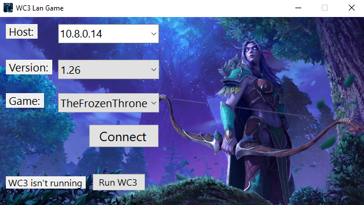
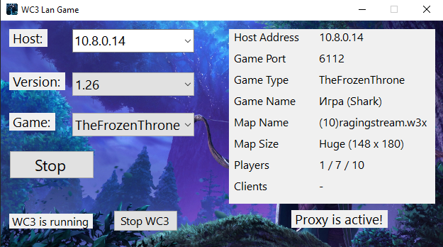

# Overview

This program allows you to play Warcraft 3 multiplayer over the internet just like if you were all in the same LAN. It does this by forwarding data between your network and the host so that they appear to be on the same LAN.

Network code based on [WC3 Proxy project](https://github.com/leonardodino/wc3proxy).

## Features

 * Displays game details (Name, map, players etc)
 * Can act as a proxy for multiple clients on a LAN.
 * Has a system tray icon that shows popups when games are found.
 * Proxied games show as "Proxy Game" instead of "Local Game" in Warcraft 3.
 * Does not require fiddling with port numbers
 * Autodetect installed game version
 * Automatically scanning all local networks and find potential servers that replied on ping
 * Work with WC3 versions 1.21 to 1.29

## Usage

 * The host hosts a LAN game in Warcraft 3.  Port 6112 must be accessible to the other players.
 * Everyone else runs WC3Proxy and enters the host's IP address in the "Host" field.  Choose the game type (Reign of Chaos / The Frozen Throne).
 * Players then launch Warcraft 3 and choose the "Local Area Network" option.  The host's game should appear in the game list.

## [download][releases-page]
 

## Notes

The game information will disappear when the game is started.

The three player counts are: current human players, total slots for human players and total slots.  The second number includes any player slots which are not closed and not AI players.  This means it also includes slots which are currently occupied by human players.  Warcraft 3 displays the player count as: total slots - human slots + human players.
