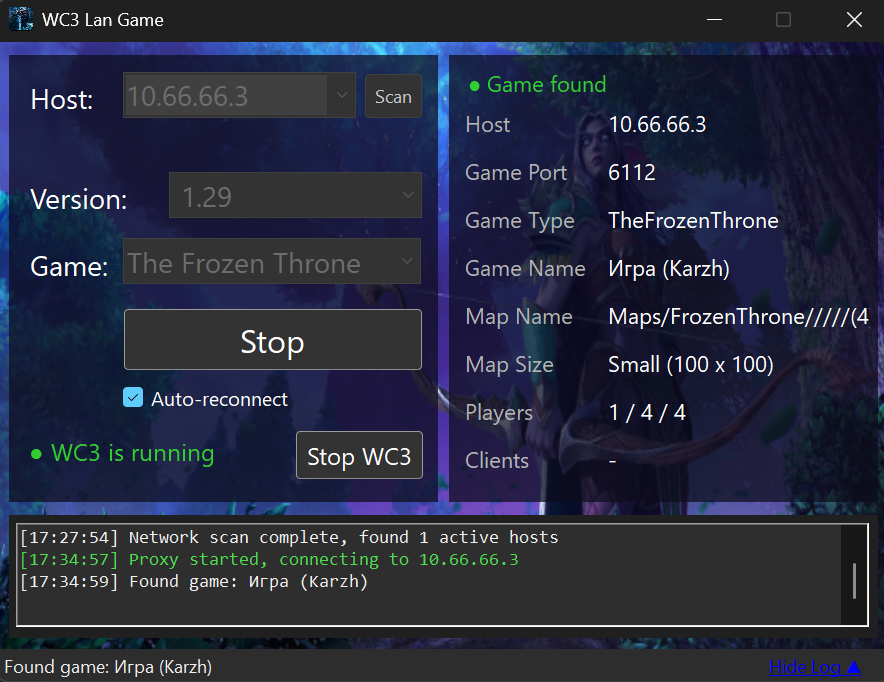
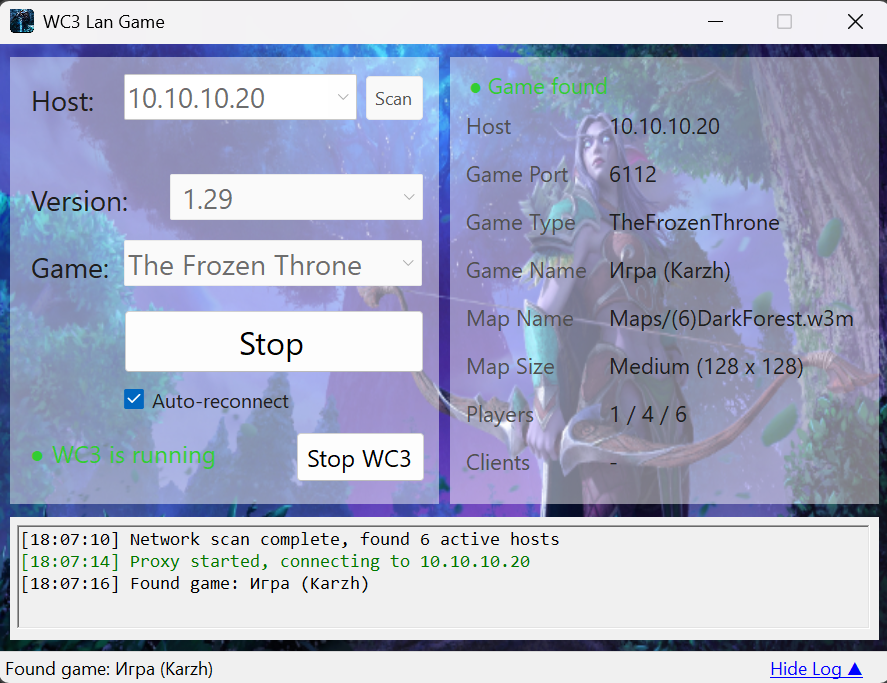

# WC3LanGame

WC3LanGame is a Windows app for playing classic Warcraft III LAN games with people who are not on the same physical network. It lets players join a remote LAN hosted game by finding it through the host, publishing it again on the player's local network, and proxying Warcraft III connections back to the host.

The host still runs the real Warcraft III LAN game. WC3LanGame is not a matchmaking service, hosting service, or Battle.net replacement.

## Download

Get the latest release from [GitHub Releases](https://github.com/Qyperion/WC3LanGame/releases).

Release assets:

* `WC3LanGame.exe` is smaller and needs the [.NET 10 Desktop Runtime](https://dotnet.microsoft.com/download/dotnet/10.0) installed on Windows.
* `WC3LanGame.NET.10.integrated.exe` is larger and includes .NET, so it is the easiest choice if you are not sure whether the runtime is installed.

## Features

* LAN-over-internet proxying for Warcraft III classic games, with dynamic local ports and multiple local clients.
* Local game announcements, usually shown as `Proxy Game`, with game/map details, players, clients, host, and latency.
* Host scanner, Warcraft III executable/version detection, and Run WC3 / Stop WC3 actions.
* Auto reconnect, tray controls and notifications, expandable logs, saved settings, and Light/Dark/System themes.
* Supports Reign of Chaos, The Frozen Throne, and Warcraft III classic versions 1.21 to 1.29.

## Requirements

* Windows 10, 11.
* Warcraft III classic version 1.21 to 1.29.
* Reign of Chaos or The Frozen Throne, matching the game being hosted.
* Network reachability from each player to the host.
* Firewall, VPN, router, NAT, and ISP rules must allow the host's Warcraft III traffic.
* The host's Warcraft LAN service is queried on UDP port 6112 by default.
* The host's Warcraft III game connection must also be reachable over TCP.

For remote players, the recommended approach is [ZeroTier](https://www.zerotier.com/). It has a free tier and can put the host and players into one virtual local network, which usually avoids manual router port forwarding. After everyone joins the same ZeroTier network, use the host's ZeroTier IP address in WC3LanGame.

If players use another VPN, use the host's VPN address. If players connect over the public internet without a virtual LAN, the host usually needs port forwarding or another working NAT setup.

## Usage

### Host

* Start Warcraft III classic.
* Host a LAN game in Reign of Chaos or The Frozen Throne.
* Prefer putting everyone into one ZeroTier network, then share the host's ZeroTier IP address.
* Otherwise, make sure the host is reachable through the firewall, VPN, router, and NAT setup.

### Player

* Start WC3 Lan Game and select the hosted game type.
* Enter the host address, preferably the host's ZeroTier IP, or use the scanner on a ping-friendly local/VPN network.
* Connect, start Warcraft III with Run WC3 or manually, then open Local Area Network.
* Join the proxied game, usually shown as `Proxy Game`, and disconnect or use the tray menu when finished.

## How It Works

WC3LanGame queries the remote host's Warcraft LAN service, using UDP port 6112 by default. When it finds a game, it rewrites the LAN game announcement and broadcasts it on the player's local network.

Warcraft III then sees the remote game in the Local Area Network list as if it were nearby. When a local Warcraft III client joins, WC3LanGame accepts that local TCP connection on a dynamic proxy port and forwards it to the remote host.

The bundled packet notes in [Warcraft III Game Packet Specs](docs/Warcraft%20III%20Game%20Packet%20Specs.md) document the LAN packets used by the proxy.

## Player Counts

WC3LanGame shows three player numbers:

* Current human players means people already occupying human player slots.
* Human slots means all slots that are available for human players, including slots already occupied by humans.
* Total slots means every lobby slot, including closed slots and computer players.

Warcraft III may show a different lobby count because it uses this calculation:

```text
total slots - human slots + current human players
```

## Screenshots





## Build From Source

Build on Windows with the .NET 10 SDK installed. The app targets `net10.0-windows` and Windows Forms.

From the repository root:

```powershell
dotnet restore WC3LanGame.slnx -p:SelfContained=false
dotnet build WC3LanGame.slnx --configuration Release --no-restore -p:SelfContained=false
dotnet run --project src/App/App.csproj
```

## Troubleshooting

### The Game Does Not Appear In Warcraft III

Check that the host is actively hosting a LAN game, the selected game type/version match, and the host address is correct. For remote play, prefer the host's ZeroTier IP. Also check firewall/VPN/NAT access to UDP 6112 and the TCP game connection, then reconnect and review the logs.

### Warcraft III Executable Is Not Found

Make sure Warcraft III classic is installed. If automatic detection fails, browse to the executable manually or start Warcraft III yourself.

### The Scanner Does Not Find A Host

The scanner depends on ping replies. It may miss hosts that block ICMP, sit behind NAT, or are outside your local/VPN routes. Enter the host address manually in those cases.

### Game Information Disappears After The Game Starts

This is expected. Warcraft III LAN lobby details can stop being advertised after the host starts the match.

### `Proxy Game` Still Shows As `Local Game`

The rename is language sensitive. Some languages or patches may keep the original listing name while the proxy still works.

## Credits

WC3LanGame keeps attribution to [WC3Proxy](https://github.com/leonardodino/wc3proxy), which provided the base network proxy approach.

Warcraft III is created by Blizzard Entertainment.

## License

This project is licensed under the MIT License. See [LICENSE.txt](LICENSE.txt).
